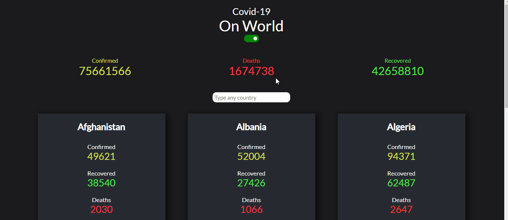

<h1 align="center">😷 Covid-19 Dashboard</h1>

## About

Covid19 Dashboard is an application that provides real time data of Covid19.
<a href="https://covid19api.com/">Api used in this project</a>. You can acess this project on that <a href="https://covid19-dashboard-3910.netlify.app/">link</a>.

## Tecnologies

- ✔️ ReactJS
- ✔️ React Hooks
- ✔️ Context API
- ✔️ Styled-Components
- ✔️ Axios
- ✔️ React Switch
